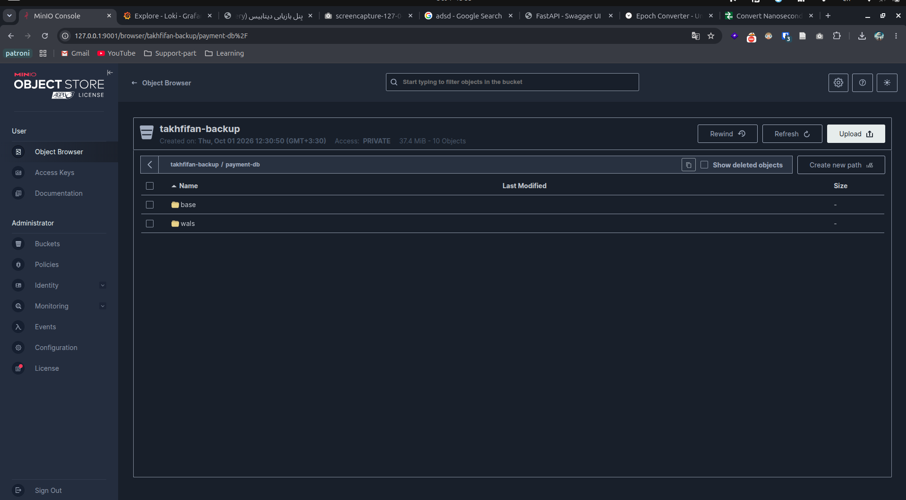
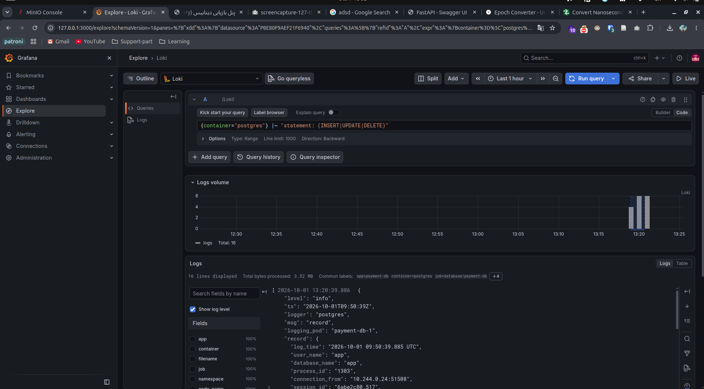
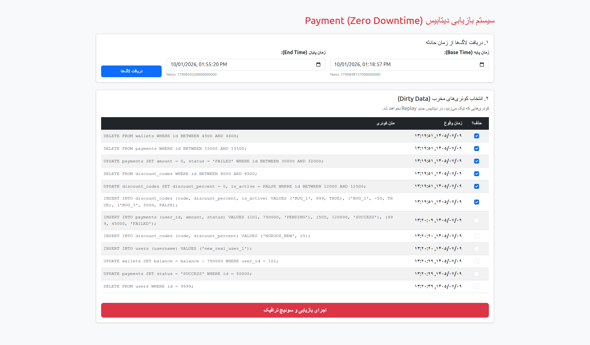
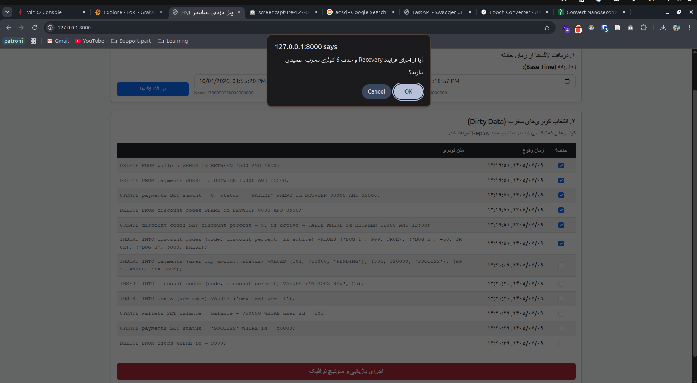
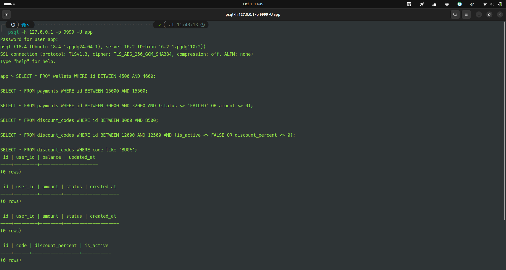
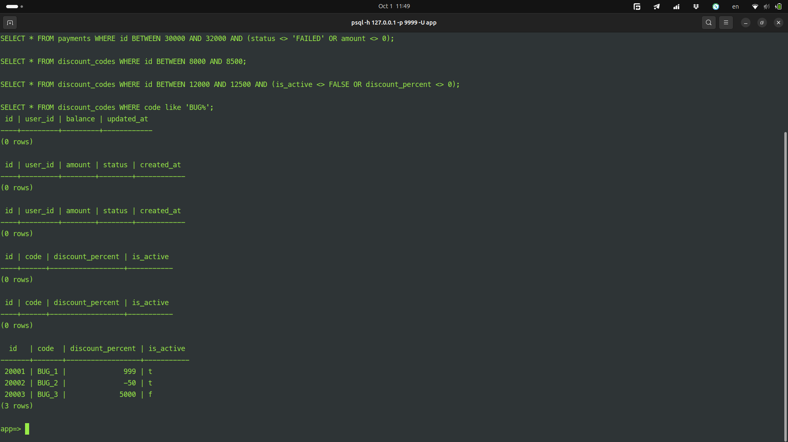
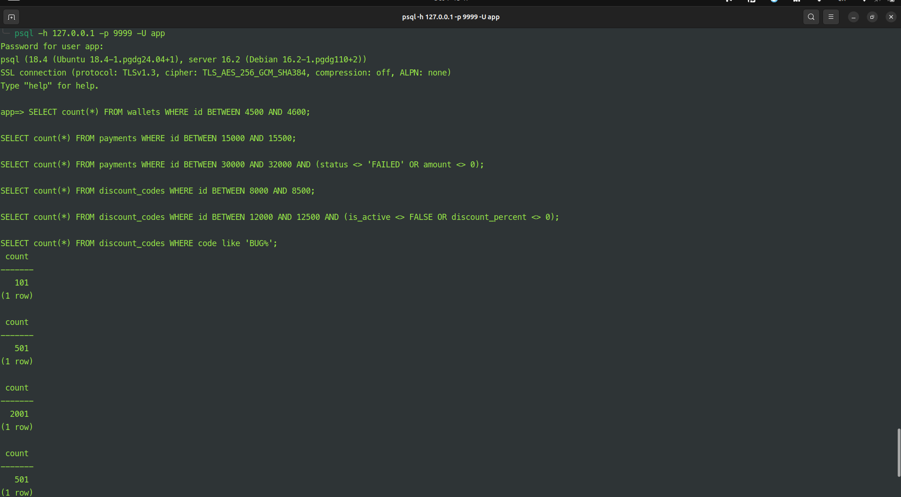
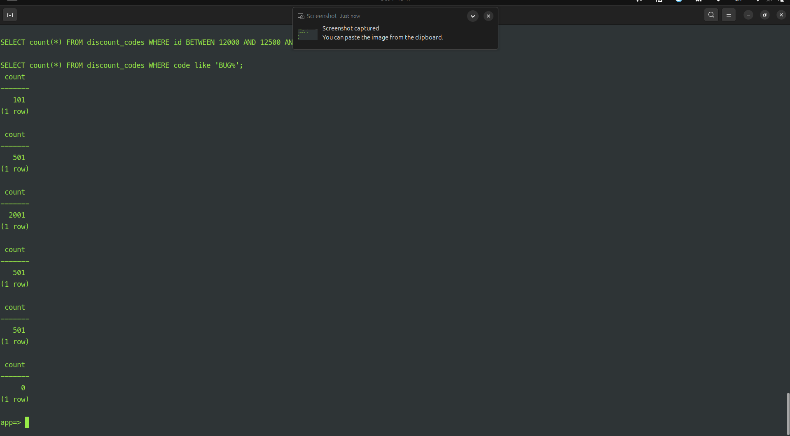

# 🚀 پروژه بازیابی پیشرفته پایگاه داده Payment (PITR & Surgical Log Replay)
**آزمون فنی DevOps/DBA - شرکت تخفیفان**

## 📑 فهرست مطالب
1. [معرفی و صورت مسئله](#معرفی-و-صورت-مسئله)
2. [معماری و استراتژی حل مسئله](#معماری-و-استراتژی-حل-مسئله)
3. [پیش‌نیازها](#پیش‌نیازها)
4. [راهنمای نصب و استقرار (Runbook)](#راهنمای-نصب-و-استقرار-runbook)
5. [سناریوی بازیابی (Recovery Workflow)](#سناریوی-بازیابی-recovery-workflow)
6. [ساختار پروژه](#ساختار-پروژه)

---

## 🎯 معرفی و صورت مسئله
در سرویس حساس Payment، در ساعت `12:45` یک Incident رخ داده که منجر به ورود Dirty Data به دیتابیس شده است. این داده‌های خراب شامل رکوردهای حذف شده، تغییر یافته و یا تراکنش‌های نامعتبر هستند. 
**اهداف اصلی:**
* **RPO نزدیک به صفر:** جلوگیری از هرگونه Data Loss برای تراکنش‌های سالم.
* **RTO حداقلی:** بازگشت سریع سرویس به حالت پایدار.
* **جراحی دقیق (Surgical Fix):** حذف فقط کوئری‌های مخرب و Replay کردن کوئری‌های سالم.

---

## 🏗 معماری و استراتژی حل مسئله
به جای استفاده از روش‌های سنتی Master-Slave، در این پروژه از رویکرد **Cloud-Native** با استفاده از **CloudNativePG (CNPG)** در بستر Kubernetes استفاده شده است. 

**چرا CNPG به جای Streaming Replication سنتی؟**
1. مدیریت خودکار WALها و آرشیو در S3 (MinIO).
2. قابلیت PITR (Point-In-Time Recovery) یکپارچه.
3. امکان ترکیب PITR با **Logical Log Replay** برای فیلتر کردن کوئری‌های خراب (که در ریپلیکیشن سنتی بسیار پیچیده است).

### 🔄 چرخه حیات بازیابی (Recovery Lifecycle)
1. **Base Backup:** دیتابیس به صورت مداوم از WALها در MinIO بکاپ می‌گیرد.
2. **PITR Cluster:** یک کلاستر جدید از روی بکاپ تا زمانِ قبل از Incident (مثلاً 12:44) بازیابی می‌شود.
3. **Log Replay:** اپلیکیشن FastAPI با استفاده از Loki، لاگ‌های کوئری‌های بین زمان بکاپ و زمان حال را استخراج می‌کند.
4. **Surgical Filter:** کوئری‌های خراب (Bad Queries) فیلتر شده و کوئری‌های سالم روی کلاستر PITR اجرا می‌شوند.
5. **Traffic Switch:** ترافیک از طریق CNPG Pooler به کلاستر جدید منتقل و کلاستر قدیمی حذف می‌شود.

📸 **[تصویر ۱: دیاگرام معماری کلی سیستم (شامل K8s, CNPG, MinIO, Loki, FastAPI)]**
*(پیشنهاد: یک دیاگرام در Draw.io یا Excalidraw بکشید که جریان WAL به MinIO و جریان لاگ از Loki به FastAPI را نشان دهد)*

---

## 🛠 پیش‌نیازها
* [kind](https://kind.sigs.k8s.io/) (برای لوکال) یا یک کلاستر Kubernetes
* [kubectl](https://kubernetes.io/docs/tasks/tools/)
* [Helm](https://helm.sh/)
* دسترسی به اینترنت برای Pull کردن ایمیج‌ها و چارت‌ها

---

## 📘 راهنمای نصب و استقرار (Runbook)

### ۱. ایجاد کلاستر و نصب ابزارهای پایه
```bash
# ایجاد کلاستر kind
kind create cluster --name takhfifan

# اضافه کردن ریپازیتوری‌های Helm
helm repo add minio https://charts.min.io/
helm repo add grafana https://grafana.github.io/helm-charts
helm repo add prometheus-community https://prometheus-community.github.io/helm-charts
helm repo update
```

### ۲. نصب MinIO (برای ذخیره WAL و Backup)
```bash
kubectl create namespace minio
helm install minio minio/minio -f minio-values.yaml -n minio
```


📸 **[تصویر ۲: اسکرین‌شات از پنل MinIO که نشان‌دهنده وجود Bucket و WALهای ذخیره شده است]**

### ۳. نصب CloudNativePG و دیتابیس
```bash
kubectl apply --server-side -f https://raw.githubusercontent.com/cloudnative-pg/cloudnative-pg/release-1.22/releases/cnpg-1.22.1.yaml
kubectl create namespace database
kubectl apply -f pg-cluster.yaml -n database
kubectl apply -f pooler.yaml -n database
```

### ۴. نصب استک مانیتورینگ (Loki, Prometheus, Grafana)
```bash
kubectl create namespace monitoring
helm upgrade --install loki grafana/loki-stack --namespace monitoring -f loki-stack-values.yaml
helm upgrade --install prometheus-stack prometheus-community/kube-prometheus-stack --namespace monitoring -f kube-prometheus-stack-values.yaml
```

📸 **[تصویر ۳: داشبورد Grafana که نشان‌دهنده سلامت پادها و مصرف منابع دیتابیس است]**

### ۵. اجرای اپلیکیشن بازیابی (Recovery App)
```bash
kubectl apply -f k8s-manifest.yaml -n database
```

---

## 🚨 سناریوی بازیابی (Recovery Workflow)

وقتی Incident در ساعت 12:45 رخ می‌دهد، DBA/DevOps مراحل زیر را طی می‌کند:

### گام اول: ایجاد کلاستر PITR
با استفاده از `pitr-cluster.yaml`، یک کلاستر جدید از روی آخرین بکاپ سالم (قبل از 12:45) در MinIO بازیابی می‌شود.
```yaml
# بخشی از pitr-cluster.yaml
bootstrap:
  recovery:
    source: payment-db
    recoveryTarget:
      targetTime: "2026-09-30 20:35:22.871992+00:00" # زمان قبل از خرابی
```

### گام دوم: شناسایی و فیلتر کردن کوئری‌های خراب
از طریق UI اپلیکیشن، بازه زمانی Incident مشخص شده و کوئری‌های مخرب (Bad Queries) به سیستم معرفی می‌شوند.


📸 **[تصویر ۴: اسکرین‌شات از رابط کاربری (UI) اپلیکیشن که لاگ‌های Loki را نشان می‌دهد و کوئری‌های بد در آن هایلایت/انتخاب شده‌اند]**

### گام سوم: اجرای منطقی (Logical Replay) و سوئیچ ترافیک
اپلیکیشن FastAPI (`main.py`) به صورت خودکار:
1. لاگ‌های سالم را از Loki می‌گیرد.
2. روی دیتابیس PITR اجرا می‌کند.
3. با استفاده از K8s API، `Pooler` را به کلاستر جدید (`payment-db-pitr`) متصل می‌کند.
4. کلاستر آلوده (`payment-db`) را حذف می‌کند.




📸 **[تصویر ۵: بررسی وضعیت دیتابیس کثیف]**




📸 **[تصویر 6: بررسی دیتابیس restore شده که نشان می دهد همه چیز به درستی برگشته است و کوئری های مناسب بعد از آن به درستی منتقل شده اند.]**

---
**توسعه‌دهنده:** محمد افضل زاده نائینی  
**ایمیل:** mohammad.afzalzadeh.3@gmail.com

